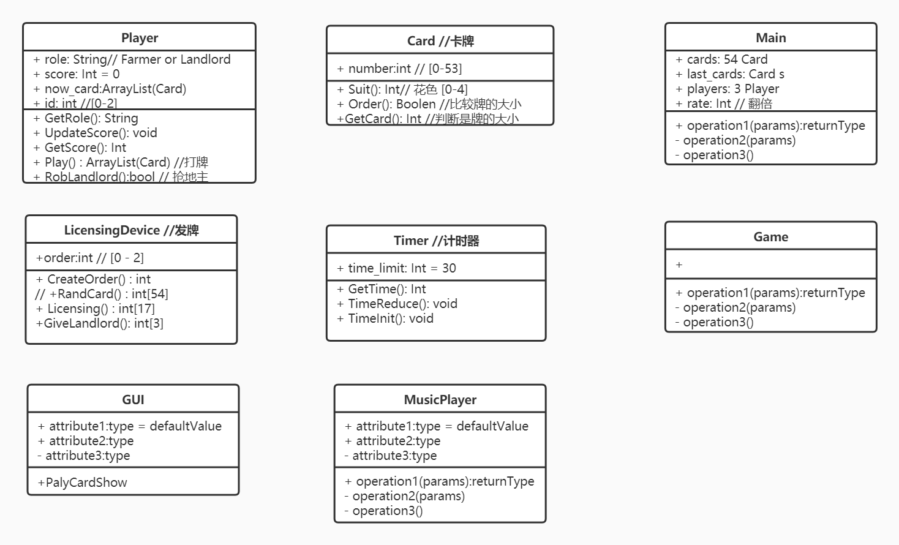

# Software-course
It is our project of software engineer course.

In the spring semester of junior year, we will use GitHub to manage the projects in the software engineering course.

## Introduction
### Name
Online fight landlord

### Function
A software can provide the function of three people fighting against the landlord

### Members
zzy, cyr, ysy, xjs

### Division
| Name | zzy | cyr | ysy | xjs  |
| :--: | :--: | :--: | :--: | :-: |
| Mission | undetermined | undetermined | undetermined | undetermined |

## Question need discuss

### 一、Programming Language

Java

### 二、Environment

OS: Manjaro 18.1.5 (Old Version: Ubuntu 18.04)

Java Version: OpenJDK 11.0.6 (Old Version: jdk-8u241)

### 三、Development cycles

- How long?
- what kind of rhythm?

### 四、Testing

How to judge the correctness of each interface program?

## 项目如何管理&开发

1. 从开始就集成，不采用分模块开发最后集成的做法
2. 多讨论，相互之间的技术交流促进进步
3. 编程在软件生命周期中占10-20%工作量
4. 设计错误63%，编码错误37%，发现越晚成本越高
5. 用正式文档资料把测试计划、详细测试方案以及实际测试结果保存下来，作为软件配置的一部分
6. 实现模块化设计的重要指导思想是：
   1. 分解
   2. 信息隐藏
   3. 模块独立性
7. 内聚更重要，应该把更多注意力集中到提高模块的内聚程度上
8. 高层模块应有较高的扇出，低层模块特别是底层模块应有较高的扇入

## 软件开发如同滚雪球
| 滚雪球 |	软件项目开发 |
| :--: | :--: |
| 坚实内核作起点|重视体系结构的规划和设计|
|从小到大慢慢来|	循序渐进的建造|
|边滚边看边调整|	连续验证，对整个软件生产过程提供及时、可靠的信息反馈|
|任何时候都近圆|	及早集成|
|早晚一天要崩溃|	一个软件总有一天会寿终正寝，更新不如从头设计新系统|

## UML

## Time invested in this project
|Data|05/02|06/02|07/02|08/02|09/02|10/02|11/02|
|:--:|:--:|:--:|:--:|:--:|:--:|:--:|:--:|
|Time segments|20:00-23:00|14:00-16:30|14:30-16:30|14:00-16:30|14:00-16:30|14:00-16:30|14:00-16:30|
|Hours|3|2.5|2|2.5|2.5|2.5|2.5|

|Date|13/02|14/02|
|:--:|:--:|:--:|
|Time segments|14:00-16:30|14:00-16:30|
|Hours|2.5|2.5|

## Mission in every week
Our Project start at 06/02/2020

| Date | Missions |
| :--: | :--: |
| 06/02-09/02 | 1.Build the environment(Ubuntu,Java,Git) 2. Git Learning 3.Software PPT  |
|10/02-16/02| 1. Continue learning software PPT 2. Familiarity with java 3. Review the usage of inheritance, polymorphism and interface 4. Strengthen the expression of class relation in UML |

## Study Web
- Java Swing :  https://blog.csdn.net/xietansheng/article/details/72814492
